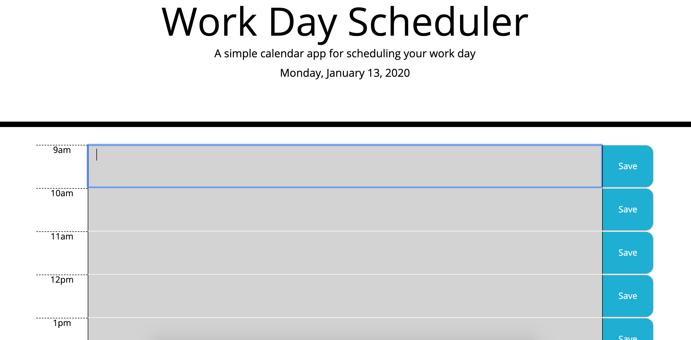

# homework-5

The purpose of this application is to simplify the users work day by keeping track of the date, the time of the day, and tasks that the user inputs into each hour. Each hour of the day is color coded: hours that have passed are gray, the current hour is red, and future hours are green.

This application layout was created using a Bootstrap table. Therefore, it's features are dynamic and look good on any screen size.
A JQuery each loop was used to loop through an array of times, creating a div for each time of the day. A time div, text area, and save button are appended to each div.
When the user saves input in a specific hour's text area, the text is saved into that index of an array, which is stringified and saved into local storage. The user input remains in the calendar after the page is reloaded.
An object in Moment.js retrieves the current date and time, which are stored into variables and displayed on the screen.

